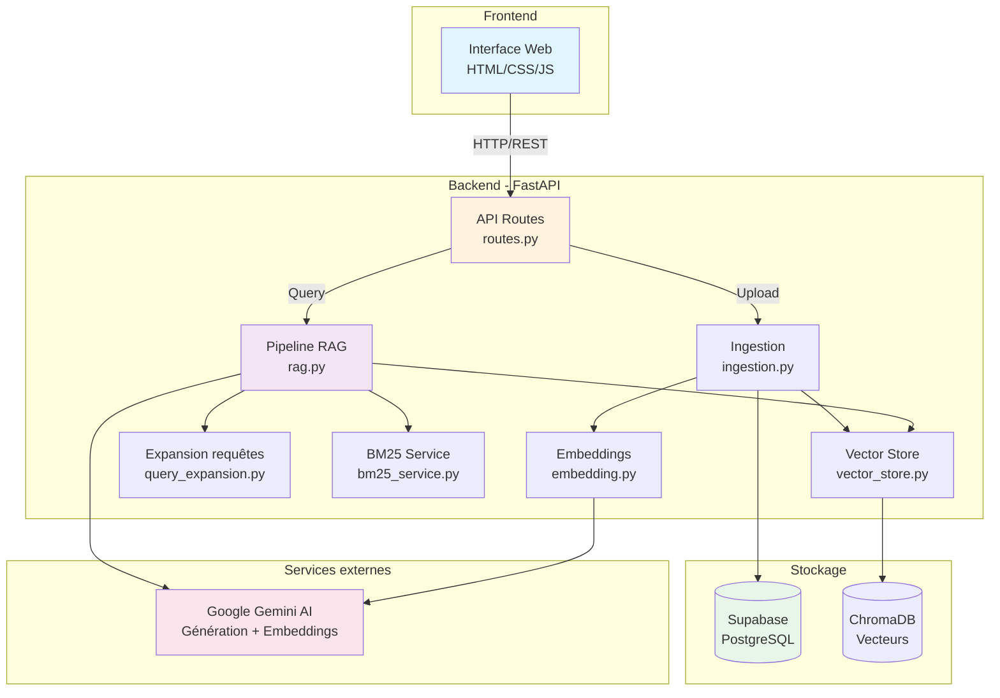
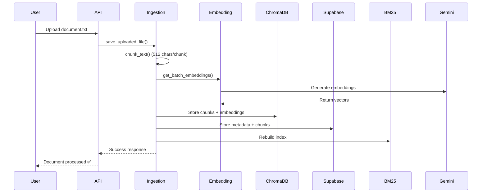
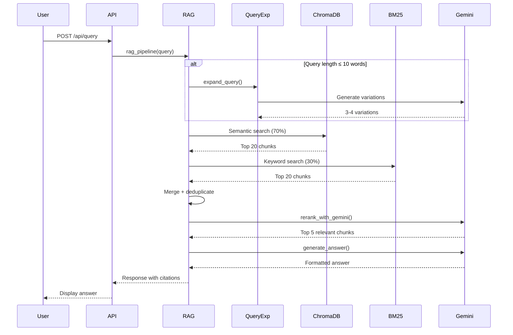
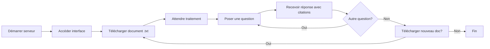

# Manuel de Déploiement et d'Exploitation - Nibras RAG System

## 📋 Table des Matières

1. [Vue d'ensemble](#vue-densemble)
2. [Architecture de l'application](#architecture-de-lapplication)
3. [Prérequis système](#prérequis-système)
4. [Installation](#installation)
5. [Configuration](#configuration)
6. [Gestion du serveur](#gestion-du-serveur)
7. [Utilisation de l'application](#utilisation-de-lapplication)
8. [Structure des fichiers](#structure-des-fichiers)
9. [API REST](#api-rest)
10. [Dépannage](#dépannage)
11. [Maintenance](#maintenance)

---

## Vue d'ensemble

**Nibras** (نِبراس) est un système RAG (Retrieval-Augmented Generation) multilingue avancé qui permet d'interroger intelligemment des documents textuels en arabe, français et anglais.

### Fonctionnalités principales

- ✅ **Précision élevée** - Système RAG optimisé avec expansion de requêtes
- 🌍 **Support multilingue** - Arabe, Français, Anglais
- 🔍 **Recherche hybride** - Combinaison sémantique (70%) + mots-clés (30%)
- 🎯 **Re-classement intelligent** - Utilisant Gemini AI pour optimiser la pertinence
- 📚 **Citations automatiques** - Références claires aux sources
- ⚡ **Interface moderne** - Interface bilingue (AR/FR) avec design responsive

### Technologies utilisées

| Composant | Technologie |
|-----------|-------------|
| **Backend** | FastAPI (Python) |
| **Serveur web** | Uvicorn (ASGI) |
| **Base de données** | Supabase (PostgreSQL) |
| **Vecteurs** | ChromaDB |
| **IA générative** | Google Gemini AI |
| **Embeddings** | Gemini Embedding (models/embedding-001) |
| **Frontend** | HTML5, CSS3, JavaScript (Vanilla) |

---

## Architecture de l'application



### Flux de traitement des documents



### Flux de requête RAG



---

## Prérequis système

### Logiciels requis

- **Python** : Version 3.9 ou supérieure
- **pip** : Gestionnaire de paquets Python
- **Git** : Pour cloner le dépôt (optionnel)

### Comptes de services externes

1. **Google AI Studio**
   - Créer un compte sur [Google AI Studio](https://makersuite.google.com/)
   - Générer une clé API Gemini
   - Activer l'accès aux modèles `gemini-1.5-flash` et `embedding-001`

2. **Supabase**
   - Créer un compte sur [Supabase](https://supabase.com/)
   - Créer un nouveau projet
   - Récupérer l'URL du projet et la clé API (anon key)

### Configuration matérielle recommandée

| Ressource | Minimum | Recommandé |
|-----------|---------|------------|
| **CPU** | 2 cœurs | 4+ cœurs |
| **RAM** | 4 GB | 8+ GB |
| **Disque** | 2 GB libre | 10+ GB |
| **Réseau** | Connexion Internet stable | - |

---

## Installation

### Étape 1 : Cloner ou télécharger le projet

**Option A : Avec Git**
```bash
git clone https://github.com/votre-repo/rag-with-antgravity.git
cd rag-with-antgravity
```

**Option B : Téléchargement manuel**
- Télécharger et extraire l'archive ZIP du projet
- Ouvrir un terminal dans le dossier extrait

### Étape 2 : Installer les dépendances Python

```bash
pip install -r requirements.txt
```

**Dépendances installées :**
- `fastapi` - Framework web moderne
- `uvicorn` - Serveur ASGI
- `python-dotenv` - Gestion variables d'environnement
- `supabase` - Client Supabase
- `chromadb` - Base de données vectorielle
- `google-generativeai` - SDK Gemini AI
- `python-multipart` - Support upload de fichiers
- `langchain-text-splitters` - Découpage de texte
- `httpx` - Client HTTP

### Étape 3 : Initialiser la base de données Supabase

1. **Se connecter à Supabase**
   - Accéder au dashboard de votre projet

2. **Exécuter le schéma SQL**
   - Ouvrir l'éditeur SQL
   - Copier et exécuter le contenu de `supabase_schema.sql` :

```sql
-- Table des documents
CREATE TABLE documents (
    id UUID PRIMARY KEY DEFAULT uuid_generate_v4(),
    filename TEXT NOT NULL,
    chunk_count INTEGER,
    upload_date TIMESTAMP DEFAULT NOW()
);

-- Table des chunks (fragments)
CREATE TABLE chunks (
    id UUID PRIMARY KEY DEFAULT uuid_generate_v4(),
    document_id UUID REFERENCES documents(id) ON DELETE CASCADE,
    chunk_index INTEGER,
    content TEXT,
    embedding_id TEXT
);

-- Index pour optimiser les requêtes
CREATE INDEX idx_chunks_document_id ON chunks(document_id);
CREATE INDEX idx_chunks_embedding_id ON chunks(embedding_id);
```

---

## Configuration

### Fichier `.env`

Créer un fichier `.env` à la racine du projet avec le contenu suivant :

```env
# ============================================
# Configuration Gemini AI
# ============================================
GEMINI_API_KEY=votre_clé_api_gemini_ici

# Modèles Gemini
VITE_GEMINI_CHAT_MODEL=gemini-1.5-flash
VITE_GEMINI_EMBEDDING_MODEL=models/embedding-001

# ============================================
# Configuration Supabase
# ============================================
VITE_SUPABASE_URL=https://votre-projet.supabase.co
VITE_SUPABASE_ANON_KEY=votre_clé_anon_supabase_ici
```

> [!IMPORTANT]
> **Sécurité** : Ne jamais commiter le fichier `.env` dans Git. Il est déjà dans `.gitignore`.

### Obtenir les clés API

#### Google Gemini API Key

1. Aller sur [Google AI Studio](https://makersuite.google.com/app/apikey)
2. Se connecter avec un compte Google
3. Cliquer sur "Create API Key"
4. Copier la clé générée
5. La coller dans `.env` comme valeur de `GEMINI_API_KEY`

#### Supabase URL et Key

1. Accéder au dashboard Supabase
2. Aller dans **Settings** → **API**
3. Copier :
   - **Project URL** → `VITE_SUPABASE_URL`
   - **anon public** → `VITE_SUPABASE_ANON_KEY`

### Structure du fichier de configuration (config.py)

Le fichier `app/core/config.py` charge automatiquement les variables depuis `.env` :

```python
import os
from dotenv import load_dotenv

load_dotenv()

class Settings:
    GEMINI_API_KEY = os.getenv("GEMINI_API_KEY")
    SUPABASE_URL = os.getenv("VITE_SUPABASE_URL")
    SUPABASE_KEY = os.getenv("VITE_SUPABASE_ANON_KEY")
    GEMINI_CHAT_MODEL = os.getenv("VITE_GEMINI_CHAT_MODEL")
    GEMINI_EMBEDDING_MODEL = os.getenv("VITE_GEMINI_EMBEDDING_MODEL")

settings = Settings()
```

---

## Gestion du serveur

### 🚀 Démarrer le serveur

#### Commande standard

```bash
python -m uvicorn app.main:app --reload --host 0.0.0.0 --port 8000
```

**Explication des paramètres :**

| Paramètre | Description |
|-----------|-------------|
| `app.main:app` | Chemin vers l'application FastAPI |
| `--reload` | Redémarrage automatique lors de modifications du code |
| `--host 0.0.0.0` | Écoute sur toutes les interfaces réseau |
| `--port 8000` | Port du serveur (8000 par défaut) |

#### Démarrage en production (sans auto-reload)

```bash
python -m uvicorn app.main:app --host 0.0.0.0 --port 8000
```

> [!TIP]
> Retirer `--reload` en production pour de meilleures performances.

#### Démarrage avec journalisation détaillée

```bash
python -m uvicorn app.main:app --reload --host 0.0.0.0 --port 8000 --log-level debug
```

### 🔄 Redémarrer le serveur

#### Méthode 1 : Arrêt + Démarrage manuel

1. **Arrêter** : Appuyer sur `Ctrl + C` dans le terminal
2. **Démarrer** : Relancer la commande uvicorn

```bash
# Arrêt : Ctrl + C

# Redémarrage
python -m uvicorn app.main:app --reload --host 0.0.0.0 --port 8000
```

#### Méthode 2 : Auto-reload (mode développement)

Avec l'option `--reload`, le serveur redémarre automatiquement lors de :
- Modifications de fichiers `.py`
- Ajout/suppression de fichiers dans le projet

> [!NOTE]
> L'auto-reload **ne** fonctionne **pas** pour les modifications de `.env`. Redémarrage manuel requis.

#### Méthode 3 : Utiliser PowerShell pour redémarrage complet

**Windows PowerShell :**
```powershell
# Arrêter tous les processus uvicorn
Get-Process -Name "python" | Where-Object {$_.CommandLine -like "*uvicorn*"} | Stop-Process -Force

# Redémarrer
python -m uvicorn app.main:app --reload --host 0.0.0.0 --port 8000
```

### ⏹️ Arrêter le serveur

#### Méthode 1 : Arrêt normal (terminal actif)

```bash
# Appuyer sur :
Ctrl + C
```

Le serveur s'arrêtera proprement en terminant les requêtes en cours.

#### Méthode 2 : Forcer l'arrêt (PowerShell)

**Windows PowerShell :**
```powershell
# Trouver le processus Python qui exécute uvicorn
Get-Process -Name "python" | Where-Object {$_.CommandLine -like "*uvicorn*"}

# Arrêter le processus
Get-Process -Name "python" | Where-Object {$_.CommandLine -like "*uvicorn*"} | Stop-Process -Force
```

#### Méthode 3 : Arrêt par port (si le port est bloqué)

**Windows :**
```powershell
# Trouver le processus utilisant le port 8000
netstat -ano | findstr :8000

# Tuer le processus (remplacer PID par l'ID du processus)
taskkill /PID <PID> /F
```

**Exemple :**
```powershell
# Résultat de netstat
TCP    0.0.0.0:8000    0.0.0.0:0    LISTENING    12345

# Arrêter le processus 12345
taskkill /PID 12345 /F
```

### 🔍 Vérifier l'état du serveur

#### Test de connexion

**Dans un navigateur :**
```
http://localhost:8000
```

Vous devriez voir l'interface Nibras.

**Via commande curl (PowerShell) :**
```powershell
curl http://localhost:8000/api/documents
```

#### Consulter les logs du serveur

Les logs s'affichent dans le terminal où uvicorn est lancé :

```
INFO:     Started server process [12345]
INFO:     Waiting for application startup.
INFO:     Application startup complete.
INFO:     Uvicorn running on http://0.0.0.0:8000 (Press CTRL+C to quit)
```

**Logs lors d'une requête :**
```
INFO:     127.0.0.1:54321 - "GET / HTTP/1.1" 200 OK
INFO:     127.0.0.1:54322 - "GET /static/style.css HTTP/1.1" 200 OK
INFO:     127.0.0.1:54323 - "GET /static/app.js HTTP/1.1" 200 OK
```

### 🛠️ Scripts de gestion (optionnel)

Créer des scripts pour simplifier les opérations quotidiennes.

#### Script de démarrage (start.ps1)

```powershell
# start.ps1
Write-Host "🚀 Démarrage du serveur Nibras RAG..." -ForegroundColor Green
python -m uvicorn app.main:app --reload --host 0.0.0.0 --port 8000
```

**Utilisation :**
```powershell
.\start.ps1
```

#### Script d'arrêt (stop.ps1)

```powershell
# stop.ps1
Write-Host "⏹️ Arrêt du serveur Nibras RAG..." -ForegroundColor Yellow

$processes = Get-Process -Name "python" -ErrorAction SilentlyContinue | 
    Where-Object {$_.CommandLine -like "*uvicorn*"}

if ($processes) {
    $processes | Stop-Process -Force
    Write-Host "✅ Serveur arrêté avec succès" -ForegroundColor Green
} else {
    Write-Host "ℹ️ Aucun serveur en cours d'exécution" -ForegroundColor Cyan
}
```

**Utilisation :**
```powershell
.\stop.ps1
```

#### Script de redémarrage (restart.ps1)

```powershell
# restart.ps1
Write-Host "🔄 Redémarrage du serveur Nibras RAG..." -ForegroundColor Cyan

# Arrêt
& .\stop.ps1

# Attente de 2 secondes
Start-Sleep -Seconds 2

# Démarrage
& .\start.ps1
```

**Utilisation :**
```powershell
.\restart.ps1
```

---

## Utilisation de l'application

### Accès à l'interface

Une fois le serveur démarré, accéder à l'interface web :

```
http://localhost:8000
```

ou depuis un autre appareil sur le même réseau :

```
http://<adresse-ip-serveur>:8000
```

### Workflow utilisateur



### Télécharger un document

1. Cliquer sur la zone "رفع المستندات" (Upload de documents)
2. Sélectionner un fichier `.txt` (encodage UTF-8)
3. Attendre la confirmation de traitement

**Formats acceptés :**
- `.txt` uniquement
- Encodage UTF-8 recommandé
- Taille maximale : aucune limite technique (limité par ChromaDB)

**Traitement automatique :**
- Découpage en chunks de 512 caractères
- Génération d'embeddings vectoriels
- Stockage dans ChromaDB et Supabase
- Indexation BM25 pour recherche par mots-clés

### Poser une question

1. Taper la question dans le champ de saisie
2. Appuyer sur `Entrée` ou cliquer sur le bouton "Envoyer"
3. Attendre la réponse (30-60 secondes)

**Exemples de questions :**

**En français :**
```
Quels sont les principaux risques de l'IA?
Comment fonctionne l'apprentissage profond?
```

**En arabe :**
```
ما هي مخاطر الذكاء الاصطناعي؟
كيف يعمل التعلم العميق؟
```

**En anglais :**
```
What are the main AI risks?
How does deep learning work?
```

### Comprendre les réponses

Chaque réponse contient :

1. **Introduction** - Contexte de la question
2. **Corps de réponse** - Information détaillée
3. **Citations** - Références numérotées [1], [2], etc.
4. **Références** - Liste des documents sources

**Exemple de réponse :**
```markdown
Les principaux risques de l'IA incluent les biais algorithmiques [1], 
la perte de contrôle [2] et les impacts sociétaux [1][3].

Les biais peuvent provenir des données d'entraînement qui reflètent 
des inégalités existantes [1].

**Références:**
[1] Enjeux éthiques de l'IA
[2] Contrôle et gouvernance IA
[3] Impact sociétal des technologies
```

---

## Structure des fichiers

```
rag-with-antgravity/
│
├── app/                          # Code backend
│   ├── __init__.py
│   ├── main.py                   # Point d'entrée FastAPI
│   │
│   ├── api/                      # API REST
│   │   ├── __init__.py
│   │   └── routes.py             # Endpoints /upload, /query, /documents
│   │
│   ├── core/                     # Configuration
│   │   ├── __init__.py
│   │   └── config.py             # Variables d'environnement
│   │
│   └── services/                 # Services métier
│       ├── __init__.py
│       ├── bm25_service.py       # Recherche BM25 (mots-clés)
│       ├── database.py           # Client Supabase
│       ├── embedding.py          # Génération d'embeddings
│       ├── ingestion.py          # Traitement documents
│       ├── query_expansion.py    # Expansion de requêtes
│       ├── rag.py                # Pipeline RAG principal
│       └── vector_store.py       # Interface ChromaDB
│
├── frontend/                     # Interface utilisateur
│   ├── index.html                # Page principale
│   ├── style.css                 # Styles CSS
│   ├── app.js                    # Logique JavaScript
│   ├── nibras_logo.png           # Logo de l'application
│   └── nibras_icon.png           # Icône favicon
│
├── data/                         # Documents uploadés + ChromaDB
│   ├── *.txt                     # Documents texte
│   └── chroma_db/                # Base de données vectorielle
│
├── .env                          # Variables d'environnement (SECRET!)
├── .gitignore                    # Fichiers exclus de Git
├── requirements.txt              # Dépendances Python
├── supabase_schema.sql           # Schéma base de données
├── rebuild_database.py           # Script de reconstruction DB
├── test_golden_dataset.py        # Tests d'évaluation
├── API_DOCUMENTATION.md          # Documentation API
├── GUIDE_UTILISATION_FR.md       # Guide utilisateur
└── MANUEL_DEPLOIEMENT_FR.md      # Ce document
```

### Fichiers critiques

| Fichier | Rôle | Ne pas modifier |
|---------|------|-----------------|
| `.env` | Configuration secrète | ⚠️ Jamais commiter |
| `app/main.py` | Point d'entrée serveur | - |
| `app/api/routes.py` | Définition API | - |
| `app/services/rag.py` | Cœur du système RAG | ✅ Bien comprendre avant |
| `requirements.txt` | Dépendances | Uniquement pour maj versions |

---

## API REST

### Endpoints disponibles

#### 1. Page d'accueil

```http
GET /
```

**Réponse :** Retourne `frontend/index.html`

---

#### 2. Télécharger un document

```http
POST /api/upload
Content-Type: multipart/form-data

file: <fichier.txt>
```

**Réponse réussie (200) :**
```json
{
  "message": "File processed successfully",
  "data": {
    "file_path": "data/document.txt",
    "total_chars": 15234,
    "total_chunks": 28,
    "document_id": "uuid-ici",
    "status": "processed_and_stored"
  }
}
```

**Erreurs possibles :**
- `400` - Format de fichier invalide (non .txt)
- `500` - Erreur de traitement

---

#### 3. Lister les documents

```http
GET /api/documents
```

**Réponse réussie (200) :**
```json
{
  "documents": [
    {
      "id": "uuid-1",
      "filename": "document1.txt",
      "chunk_count": 28,
      "upload_date": "2025-11-22T18:00:00Z"
    },
    {
      "id": "uuid-2",
      "filename": "document2.txt",
      "chunk_count": 15,
      "upload_date": "2025-11-22T17:30:00Z"
    }
  ]
}
```

---

#### 4. Interroger le système (RAG)

```http
POST /api/query
Content-Type: application/json

{
  "query": "Qu'est-ce que l'intelligence artificielle?"
}
```

**Réponse réussie (200) :**
```json
{
  "query": "Qu'est-ce que l'intelligence artificielle?",
  "context": [
    "L'intelligence artificielle (IA) est une branche de...",
    "Les systèmes d'IA utilisent des algorithmes..."
  ],
  "answer": "L'intelligence artificielle est une discipline qui vise à créer des systèmes capables d'effectuer des tâches nécessitant l'intelligence humaine [1].\n\n**Références:**\n[1] Introduction à l'IA"
}
```

**Erreurs possibles :**
- `500` - Erreur lors du traitement de la requête

---

### Tester l'API avec curl (PowerShell)

#### Lister les documents
```powershell
curl http://localhost:8000/api/documents
```

#### Télécharger un document
```powershell
curl -X POST http://localhost:8000/api/upload `
  -F "file=@C:\chemin\vers\document.txt"
```

#### Poser une question
```powershell
$body = @{
  query = "Qu'est-ce que l'IA?"
} | ConvertTo-Json

curl -X POST http://localhost:8000/api/query `
  -H "Content-Type: application/json" `
  -d $body
```

---

## Dépannage

### Problème : Le serveur ne démarre pas

#### Erreur : "Address already in use"

**Cause :** Le port 8000 est déjà utilisé par un autre processus.

**Solution :**

```powershell
# Trouver le processus utilisant le port 8000
netstat -ano | findstr :8000

# Arrêter le processus (remplacer PID)
taskkill /PID <PID> /F

# Redémarrer le serveur
python -m uvicorn app.main:app --reload --host 0.0.0.0 --port 8000
```

**Alternative :** Utiliser un port différent

```bash
python -m uvicorn app.main:app --reload --host 0.0.0.0 --port 8080
```

Puis accéder à `http://localhost:8080`

---

#### Erreur : "ModuleNotFoundError: No module named 'fastapi'"

**Cause :** Dépendances non installées.

**Solution :**

```bash
pip install -r requirements.txt
```

---

#### Erreur : "GEMINI_API_KEY not found"

**Cause :** Le fichier `.env` n'existe pas ou est mal configuré.

**Solution :**

1. Vérifier que `.env` existe à la racine du projet
2. Vérifier la syntaxe :

```env
GEMINI_API_KEY=votre_clé_ici
```

3. Redémarrer le serveur (l'auto-reload ne charge pas `.env`)

---

### Problème : L'interface ne se charge pas

#### Symptôme : Page blanche ou erreur 404

**Vérifications :**

1. **Le serveur est-il démarré ?**
   ```bash
   # Vérifier les logs du terminal
   ```

2. **L'URL est-elle correcte ?**
   - Correct : `http://localhost:8000`
   - Incorrect : `http://localhost:8000/frontend`

3. **Les fichiers frontend existent-ils ?**
   ```bash
   # Vérifier la présence de :
   frontend/index.html
   frontend/style.css
   frontend/app.js
   ```

---

### Problème : Upload de document échoue

#### Erreur : "Only .txt files are allowed"

**Cause :** Format de fichier incorrect.

**Solution :** Convertir le document en `.txt` avec encodage UTF-8.

**Conversion dans Notepad++ :**
1. Ouvrir le fichier
2. Encodage → Convertir en UTF-8
3. Enregistrer sous → `document.txt`

---

#### Erreur : Timeout lors du traitement

**Cause :** Document trop volumineux ou serveur surchargé.

**Solutions :**

1. **Réduire la taille du document** (< 100 000 caractères)
2. **Augmenter le timeout FastAPI** (modifier `main.py`)
3. **Redémarrer le serveur** pour libérer la mémoire

---

### Problème : Réponses incorrectes ou vides

#### Symptôme : Réponse = "Aucune information trouvée"

**Causes possibles :**

1. **Aucun document uploadé**
   - Solution : Télécharger au moins un document

2. **Embeddings non générés correctement**
   - Solution : Reconstruire la base de données
   ```bash
   python rebuild_database.py
   ```

3. **ChromaDB corrompue**
   - Solution : Supprimer et reconstruire
   ```bash
   Remove-Item -Recurse -Force data/chroma_db
   python rebuild_database.py
   ```

---

#### Symptôme : Réponse dans la mauvaise langue

**Cause :** Détection de langue incorrecte.

**Solution temporaire :** Reformuler la question avec plus de mots-clés spécifiques à la langue.

**Exemple :**
- ❌ "IA?" (trop court)
- ✅ "Qu'est-ce que l'intelligence artificielle?" (français clair)

---

### Problème : Erreurs Supabase

#### Erreur : "Invalid API key"

**Cause :** Clé API incorrecte ou expirée.

**Solution :**

1. Vérifier les credentials dans `.env`
2. Regénérer les clés dans le dashboard Supabase
3. Mettre à jour `.env`
4. Redémarrer le serveur (pas d'auto-reload pour `.env`)

---

#### Erreur : "Table 'documents' does not exist"

**Cause :** Schéma Supabase non créé.

**Solution :**

1. Accéder au dashboard Supabase
2. Aller dans SQL Editor
3. Exécuter le contenu de `supabase_schema.sql`

---

### Problème : Erreurs Gemini AI

#### Erreur : "API quota exceeded"

**Cause :** Limite de requêtes gratuite dépassée.

**Solutions :**

1. Attendre le reset quotidien
2. Passer à un plan payant
3. Utiliser une autre clé API (si disponible)

---

#### Erreur : "Model not found"

**Cause :** Nom de modèle incorrect dans `.env`.

**Solution :** Vérifier les noms de modèles :

```env
VITE_GEMINI_CHAT_MODEL=gemini-1.5-flash
VITE_GEMINI_EMBEDDING_MODEL=models/embedding-001
```

Modèles valides en 2025 :
- Chat : `gemini-1.5-flash`, `gemini-1.5-pro`
- Embedding : `models/embedding-001`, `models/text-embedding-004`

---

### Logs utiles

#### Activer les logs détaillés

```bash
python -m uvicorn app.main:app --reload --host 0.0.0.0 --port 8000 --log-level debug
```

#### Logs dans les services Python

Les services impriment déjà des logs :

**Dans `rag.py` :**
```
✅ [1/5] Query received: Qu'est-ce que l'IA?
📝 [2/5] Query expanded (short query detected)
🔍 [3/5] Retrieved 40 chunks (20 semantic + 20 BM25)
🎯 [4/5] Re-ranked to top 5 chunks
✅ [5/5] Answer generated successfully
```

**Dans `ingestion.py` :**
```
📄 Processing document: document.txt
✂️ Split into 28 chunks
🔢 Generated 28 embeddings
💾 Stored in ChromaDB and Supabase
```

---

## Maintenance

### Reconstruction de la base de données

Si ChromaDB ou Supabase sont corrompus ou désynchronisés :

```bash
python rebuild_database.py
```

**Ce script :**
1. Vide ChromaDB
2. Vide les tables Supabase (`chunks` et `documents`)
3. Retraite tous les fichiers `.txt` dans `data/`
4. Régénère les embeddings
5. Reconstruit l'index BM25

> [!CAUTION]
> Cette opération **supprime toutes les données** et **peut prendre du temps** selon le nombre de documents.

---

### Sauvegarde des données

#### Sauvegarder ChromaDB

```powershell
# Copier le dossier entier
Copy-Item -Recurse data/chroma_db backup/chroma_db_2025-11-22
```

#### Sauvegarder Supabase

**Via le dashboard Supabase :**
1. Database → Backups
2. Create backup

**Via export SQL (manuel) :**
```sql
-- Exporter les documents
COPY (SELECT * FROM documents) TO '/tmp/documents_backup.csv' CSV HEADER;

-- Exporter les chunks
COPY (SELECT * FROM chunks) TO '/tmp/chunks_backup.csv' CSV HEADER;
```

---

### Mise à jour des dépendances

#### Voir les versions actuelles

```bash
pip list
```

#### Mettre à jour une dépendance

```bash
pip install --upgrade fastapi
```

#### Mettre à jour toutes les dépendances

```bash
pip install --upgrade -r requirements.txt
```

> [!WARNING]
> Tester après mise à jour pour éviter les régressions.

---

### Nettoyage des fichiers temporaires

```powershell
# Supprimer les caches Python
Remove-Item -Recurse -Force app\__pycache__
Remove-Item -Recurse -Force app\api\__pycache__
Remove-Item -Recurse -Force app\core\__pycache__
Remove-Item -Recurse -Force app\services\__pycache__

# Supprimer ChromaDB (attention : perte de données!)
Remove-Item -Recurse -Force data\chroma_db
```

---

### Monitoring et performance

#### Temps de réponse moyen

Les requêtes RAG complètes prennent **30-60 secondes** :

- **Expansion de requête** : ~5-10s (si activée)
- **Recherche vectorielle** : ~2-5s
- **Re-classement Gemini** : ~10-15s
- **Génération de réponse** : ~15-25s

#### Optimisations possibles

1. **Désactiver l'expansion pour requêtes longues**
   - Déjà implémenté (seuil : 10 mots)

2. **Réduire le nombre de chunks re-classés**
   - Modifier `rerank_with_gemini(top_k=3)` au lieu de 5

3. **Utiliser un cache de réponses**
   - Non implémenté actuellement

4. **Utiliser Gemini Flash au lieu de Pro**
   - Déjà configuré (`gemini-1.5-flash`)

---

## Annexes

### Glossaire

| Terme | Définition |
|-------|------------|
| **RAG** | Retrieval-Augmented Generation - Génération augmentée par récupération |
| **Embedding** | Représentation vectorielle d'un texte |
| **Chunk** | Fragment de texte découpé (512 caractères ici) |
| **ChromaDB** | Base de données vectorielle pour stocker les embeddings |
| **Supabase** | Backend-as-a-Service basé sur PostgreSQL |
| **BM25** | Algorithme de recherche par mots-clés (Best Matching 25) |
| **Uvicorn** | Serveur ASGI pour FastAPI |
| **ASGI** | Asynchronous Server Gateway Interface |

### Commandes rapides (Cheat Sheet)

```powershell
# ========== DÉMARRAGE ==========
python -m uvicorn app.main:app --reload --host 0.0.0.0 --port 8000

# ========== ARRÊT ==========
# Méthode 1 : Ctrl + C
# Méthode 2 :
Get-Process -Name "python" | Where-Object {$_.CommandLine -like "*uvicorn*"} | Stop-Process -Force

# ========== VÉRIFICATION ==========
# Tester la page d'accueil
curl http://localhost:8000

# Lister les documents
curl http://localhost:8000/api/documents

# ========== MAINTENANCE ==========
# Reconstruire la base
python rebuild_database.py

# Mettre à jour les dépendances
pip install --upgrade -r requirements.txt

# Nettoyer les caches
Remove-Item -Recurse -Force app\__pycache__

# ========== DÉPANNAGE ==========
# Port occupé
netstat -ano | findstr :8000
taskkill /PID <PID> /F

# Réinstaller les dépendances
pip install -r requirements.txt --force-reinstall
```

### Ressources externes

- [Documentation FastAPI](https://fastapi.tiangolo.com/)
- [Documentation Uvicorn](https://www.uvicorn.org/)
- [Google Gemini AI](https://ai.google.dev/)
- [Supabase Documentation](https://supabase.com/docs)
- [ChromaDB Documentation](https://docs.trychroma.com/)

---

## Support et contact

Pour toute question ou problème technique :

1. **Consulter ce manuel** - Section [Dépannage](#dépannage)
2. **Vérifier les logs du serveur** - Chercher les messages d'erreur
3. **Reconstruire la base de données** - `python rebuild_database.py`
4. **Contacter le support technique** - [Votre contact ici]

---

**Version du document :** 1.0.0  
**Date de dernière mise à jour :** 2025-11-22  
**Auteur :** Équipe DATA-OPTIMA / Nibras

---

> [!NOTE]
> Ce manuel est conçu pour les utilisateurs techniques ayant des connaissances de base en ligne de commande et en administration système. Pour les utilisateurs finaux, consulter le `GUIDE_UTILISATION_FR.md`.
